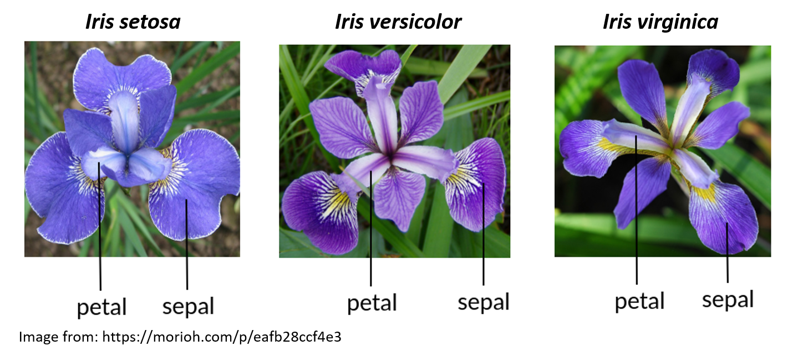
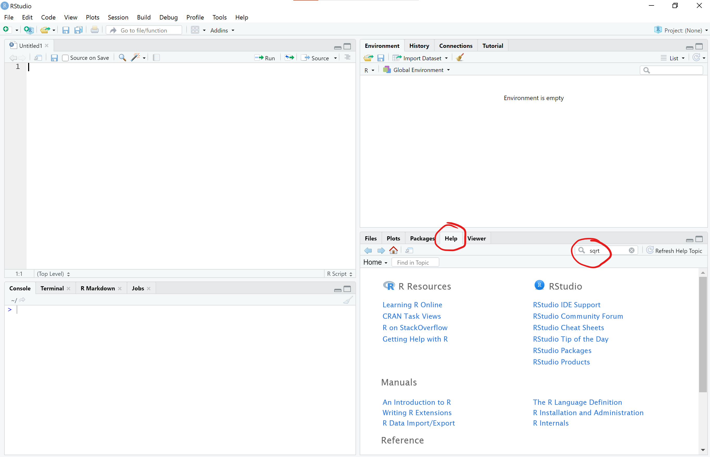
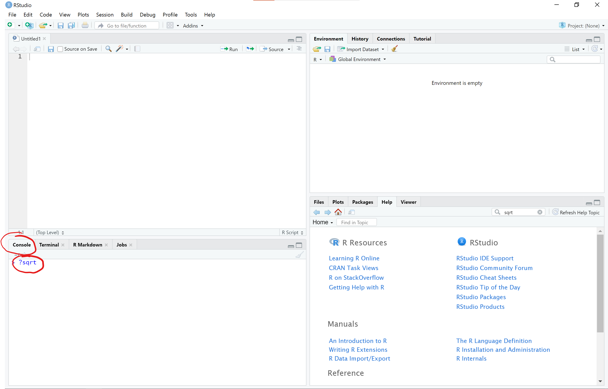
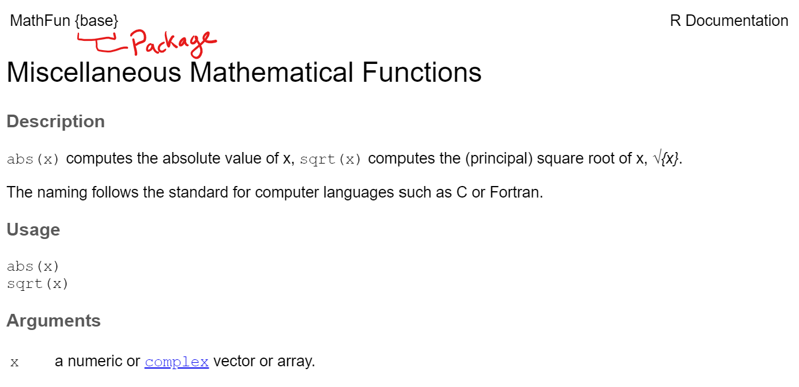

```{r setup, include=FALSE}
# packages
library(learnr)
library(gradethis)
library(ggplot2)

#sets gradethis as exercise checker
gradethis::gradethis_setup(
  code_correct = "Excellent Work!"
)

tutorial_options(exercise.reveal_solution = FALSE)

# hide non-exercise code chunks
knitr::opts_chunk$set(echo = FALSE)
```

# Intro to R for Biology:  Basics


## Introduction

Before getting started with this tutorial, it is useful to understand some of the basics about R and R Studio.  You can read [Chapter 1 Getting Started with Data in R](https://moderndive.com/1-getting-started.html) from the Modern Dive online textbook to get a basic introduction.

### Learning goals

* Why looking at data visually can be useful
* how to install and load packages
* Understand what a function is and how to use a function's help page
* Use the `head()` function to look at data frames


## Irises

*Iris* species can be difficult to tell apart in the field. Edgar Anderson measured the sepal and petal length and width of three species of *Iris* flowers to see if their flower morphology could be used to help distinguish species.  

```{r iris-pic, out.width = "70%"}

```


Below is a "chunk" with some R code. Press the **Run Code** button to run the code and make a graph showing the petal width versus the petal length for three species of *Iris* flowers.

```{r iris, exercise=TRUE}
library(ggplot2)
ggplot(data = iris, aes(x = Petal.Length, y = Petal.Width, color = Species)) +
  geom_point(size = 3) +
  ylab("Petal Width (cm)") +
  xlab("Petal Length (cm)") +
  theme_classic(base_size = 16)

```


```{r hypothesis}

quiz(
  question("Does the graph you get from the code above support the hypothesis that *Iris versicolor* is intermediate in size because it is a hybrid between *I. setosa* and *I. virginica*?",
           answer("Yes, the data are consistent with the hypothesis, but these results alone are not sufficient to know the hypothesis is definitely true", correct=TRUE),
           answer("No, the data are not consistent with the hypothesis"),
           answer("Yes, the data are consistent and sufficient to support the hypothesis"),
           answer("Yes, it is clear that *I. versicolor* is a hybrid because it is intermediate in petal size"),
    allow_retry = TRUE,
    random_answer_order = TRUE)
)


```


##   


Biologists collect data to help answer questions of interest.  The **Intro to R for Biology** series of tutorials will help you learn just enough coding in R, data manipulation, data visualization, and descriptive statistics to get you started so you can start exploring data to answer questions. 

Some of the important topics this specific tutorial will cover include

* packages
* functions
* help page
* data frames


## Packages

One of the most important thing to know about is packages. R packages are a really powerful way to put a lot of useful code, documentation, and data together to make certain tasks easier to do.

When you start a new R session, only certain packages are pre-loaded for you including the `{base}` R package and several others. But many other useful packages must be installed (once) and then loaded (every time you restart R) for you to be able to use them. A good analogy is how you have to download an app onto your computer or phone once to install it, but then you have to actually open the app each time you want to use it.

To install a package we use the code `install.packages("packageName")` - and remember, you only have to do this **ONCE** for a package on a particular computer

To load a package (open it up and use it) we use the code `library(packageName)` - and we need to do this **EVERY TIME** we want to use this package in a new session (a new session starts when you open RStudio to use it, and you can also restart R to start a new session under the "Session" menu item in RStudio)

For more background information on packages, see [What are R Packages?](https://moderndive.com/1-getting-started.html#packages)

##

The code we used to graph the *Iris* petal data had some important features you will need to know to make your own graphs.  Here is the code we ran before:

```{r iris2, echo=TRUE, eval=FALSE}
library(ggplot2)
ggplot(data = iris, aes(x = Petal.Length, y = Petal.Width, color = Species)) +
  geom_point(size = 3) +
  ylab("Petal Width (cm)") +
  xlab("Petal Length (cm)") +
  theme_classic(base_size = 16)
```

Notice we did NOT use `install.packages()` in this code because the package had already been installed.

We did use `library(ggplot2)` because we needed to load the `{ggplot2}` package (which is the main graphing package we will use in this course)

You might notice that there are a lot different words followed by parentheses.  These words followed by parentheses are called functions.

`library()` is a function what loads the package inside the parentheses.

`ggplot()` is a function from the `{ggplot2}` package that makes graphs using the code that follows it (including additional functions)

If we want to be really clear what package a function comes from, we use a double colon between the package and function name `package::function()` so in this example it would be `ggplot2::ggplot()`

We will come back to learning more about how to make graphs with `ggplot2` in later tutorials.  Let's learn more about some of the basic tools you will need to be able to make your own beautiful and informative graphs.


## Functions

One power of R is that you can also create functions that summarizes a bunch of lines of code together.

A function consists of the name of the function and then the augments you can use as inputs for the function in parentheses. 

An example is the sqrt() function that takes the square root of whatever is inside the parentheses.


What is the square root of 625? 

To find out, type `sqrt(625)` in the code chunk below and click **Run Code** to make sure it works, then click **Submit Answer** to check your answer.


```{r sqrt, exercise=TRUE}


```

```{r sqrt-solution}

sqrt(625)

```

```{r sqrt-check}

grade_this_code()

```

R prints the result of 25 (note that the [1] is telling you that your output just has one row). 


## 

sqrt() is a fairly simple function.  But let's say you are not sure how to use the function.  You can open a help document that will describe how to use the function.  

There are several ways to get to a help document for a function.  You can simply click on the Help tab in the lower right pane of RStudio and then type the name of the function in the search window

```{r sqrtHelp, out.width = "90%"}

```

Alternatively, you can also type the name of the function with a question mark in front of the function and no parentheses after in the R console (lower left pane) to open the help document

```{r sqrtHelp2, out.width = "90%"}

```

For now, let's just click on this [link to open the sqrt() help documentation](https://stat.ethz.ch/R-manual/R-devel/library/base/html/MathFun.html) 

**NOTE**: to open a link in a new tab:

* Hold down the COMMAND key and then click the link on a Mac
* Hold down the CTRL key and then click the link on Windows & Linux


## Understanding Help Documents

The help document shows the name of the help page and the package it is from at the top left corner of the help page (the package name is in the {} brackets).

```{r sqrtHelp3, out.width = "90%"}

```

The sqrt() function is from a help page called **Miscellaneous Mathematical Functions** and is abbreviated as **MathFun** in the top left corner.

The sqrt() function is part of base R so the package it is from is shown as {base}

As stated before, `sqrt()` is a simple function and only has one argument `x` which is "a numeric or complex vector or array." (which means you can put in a single value, a vector, or matrix of values inside the function)

See this link [Calling functions](https://r4ds.had.co.nz/workflow-basics.html#calling-functions) to help understand the basics of what a function is and how to use it

Sometimes the help document doesn't tell you what you want to know.  Don't feel shy about doing an internet search for more helpful answers and examples.  All of us (even the most experienced programmers) turn to the internet and other resources for help.


## Intro to Data Frames

We often want to use R to analyze a larger dataset that has many rows and columns.  We are going to skip over the basics of vectors, lists, and matrices for now, but you can look at this link about [Data Types](https://www.statmethods.net/input/datatypes.html) for a quick overview of different R data types including vectors, matrices, lists, data frames, etc

In this course, we are going to focus on **data frames**.  A data frame is a "spreadsheet"-type of dataset where each row is an observation and each column is a different variable.


Let's use the function `head()' to look at the data frame for the *Iris* flower dataset that we graphed before.

```{r head, exercise=TRUE, message=FALSE}

head(iris)

```

The `head()' function shows a preview of the first 6 rows of the data frame.

The reason you did not have to import the iris data frame into R is that this dataset is already loaded into base R.

## head() Function

Click this [link to open the head() help documentation](https://stat.ethz.ch/R-manual/R-devel/library/utils/html/head.html) in a new browser window and keep this window open for the time being.

```{r head_quiz}

quiz(
  question("What package is the head() function part of?",
           answer("utils", correct=TRUE),
           answer("base"),
           answer("dplyr"),
           answer("graphics"),
           incorrect = "Look at the top left of the help document page.  Recall that the package name is in curly brackets {} ",
    allow_retry = TRUE,
    random_answer_order = TRUE)
)

```

Notice on the help page that the head() function has two things listed under Arguments (sqrt() only had one).

Arguments are the things that go within the parentheses for a function.  In this case, there are two arguments in the head() function - x and ...
Each of these arguments is explained under the Arguments section.

Generally, for the head() function we just put in the argument x which is an R object that can be viewed as a data frame.

This is why we can type head(iris) to view the iris data (the object we are viewing in this case is iris)

By default, the `head()` function shows only the first 6 rows of the data frame.  But the `...` in the function indicates you can add additional arguments in the function.

Notice that one of the arguments we can add is `n`.  The description of of `n` under the Arguments section may seem like it is written in another language, but the gist of it is that `n` will let us select the number of rows we want to display.  Let's display 20 rows of data by running the code below.


```{r head20, exercise=TRUE, message=FALSE}

head(iris, n = 20)

```

We will learn a lot more about data frames in future tutorials.  But let's look at the iris dataset a little more.


## iris Data Frame

Because the iris data frame is included in base R, it also has a help page that describes the dataset.

Click this [link to open the iris help documentation](https://stat.ethz.ch/R-manual/R-devel/library/datasets/html/iris.html) in a new browser window and keep this window open for the time being.

Answer the questions below using information in the `iris` help document


```{r iris_quiz}

quiz(
  question("How many species of iris are included in the dataset?",
           answer("1"),
           answer("2"),
           answer("3", correct=TRUE, message="Excellent work!"),
           answer("4"),
           incorrect = "Make sure you read the Description within the iris help documentation",
           allow_retry = TRUE,
           random_answer_order = TRUE),
  question("What is represented by each row in the dataset?",
           answer("individual flowers", correct=TRUE),
           answer("each species"),
           answer("sepal lengths"),
           answer("petal widths"),
           incorrect = "Make sure you read the Description section within the iris help documentation or look at the first 6 rows shown in the last section",
           allow_retry = TRUE,
           random_answer_order = TRUE),
  question("What unit is the sepal length measured in?",
           answer("inches"),
           answer("meters"),
           answer("centimeters", correct=TRUE, message="Excellent work!"),
           answer("micrometers"),
           incorrect = "Make sure you read the Description within the iris help documentation",
           allow_retry = TRUE,
           random_answer_order = TRUE),
  question("How many flowers from each species was measured?",
           answer("50", correct=TRUE),
           answer("150"),
           answer("20"),
           answer("6"),
           incorrect = "Make sure you read the Description section within the iris help documentation",
           allow_retry = TRUE,
           random_answer_order = TRUE),
  question("How many total flowers were measured for all the species?",
           answer("50"),
           answer("20"),
           answer("150", correct=TRUE),
           answer("6"),
           incorrect = "Make sure you read the Format section within the iris help documentation",
           allow_retry = TRUE,
           random_answer_order = TRUE),
  question("How many variables (=columns) does the iris dataset have?",
           answer("3"),
           answer("4"),
           answer("5", correct=TRUE),
           answer("6"),
           incorrect = "Make sure you read the Format section within the iris help documentation",
           allow_retry = TRUE,
           random_answer_order = TRUE)
  
)


```


```{r journal}

question_text("Look back at the help file for the iris data.  What is the name of the journal where Fisher used the iris data to demonstrate some statistical methods?",
              answer("Annals of Eugenics", correct=TRUE),
              answer("annals of eugenics", message="Don't forget to capitalize"),
              incorrect = "Look under 'Source' in the iris help file, Look for the journal article with Fisher as the author.  Type the name of the journal (the words in italics) exactly as written.",
              allow_retry = TRUE,
              trim=TRUE
              )

```

While the iris data itself is just a series of measurements on flowers from a few species of irises, it is worth noting there are links between eugenics and the development of many statistical methods. 

If you are not already familiar, it would be worth spending some time understanding what eugenics is, who R.A. Fisher is, and how the field of statistics was developed.

Click here for a link to an article that can get you started on informing yourself about the links between genetics, statistics, and eugenics. [Eugenics and the Ethics of Statistical Analysis](http://gppreview.com/2019/12/16/eugenics-ethics-statistical-analysis/)


## Conclusion

There is more to learn before you can use R for data analysis and making your own graphs.  Hopefully this lesson got you started on understanding a few basic things about how R works.


Now get ready for the Learning R Roller Coaster - it is a wild ride but totally worth it!

```{r rollercoaster, out.width = "90%"}
knitr::include_graphics("images/Rrollercoaster.png")
```

Artwork by [Allison Horst](https://github.com/allisonhorst/stats-illustrations)

## Resources


* [Chapter 1 Getting Started with Data in R](https://moderndive.com/1-getting-started.html) from the Modern Dive online textbook to get a basic introduction.
* [What are R Packages?](https://moderndive.com/1-getting-started.html#packages) from the Modern Dive online textbook
* [Calling functions](https://r4ds.had.co.nz/workflow-basics.html#calling-functions) to help understand the basics of what a function is and how to use it
* [Data Types](https://www.statmethods.net/input/datatypes.html) for a quick overview of different R data types including vectors, matrices, lists, data frames, etc
* [Eugenics and the Ethics of Statistical Analysis](http://gppreview.com/2019/12/16/eugenics-ethics-statistical-analysis/)


