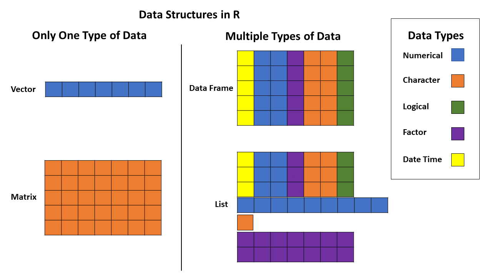
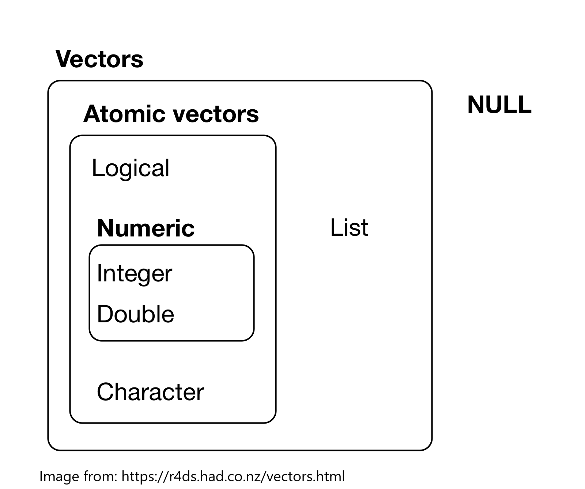

```{r setup, include=FALSE, exercise = TRUE}
# packages
library(learnr)
#devtools::install_github("rstudio-education/gradethis", force = TRUE)
library(gradethis)
library(readr)
library(dplyr)
library(ggplot2)
library(here)

#sets gradethis as exercise checker
gradethis::gradethis_setup()

tutorial_options(exercise.reveal_solution = FALSE)

# hide non-exercise code chunks
knitr::opts_chunk$set(echo = FALSE)
```

# Intro to R for Biology:  Getting Data into R


## Introduction

Before you can start analyzing any data in R, you need to be able to get your data into R

Importing data into R can be more difficult than it sounds.  It is especially important to have the data in the right format before you even try to import it into R.  Once you have imported your data, you will need to check to see if it loaded correctly.

This tutorial helps you learn some tools to import and investigate the structure of a dataset.


### Learning goals

* Learn about objects and data types in R
* Use several functions to help investigate the structure of a data frame
* Understand what tidy data is
* Practice importing a csv file


## Objects

To really understand how to import and look at the structure of data in R, we need to know some terminology.

Most often in R, we have our data in a table of rows and columns that we call a data frame. A data frame is a type of R **object**. 

There are lots of types of objects in R. Some commonly used object types include **vector**, **matrix**, **data frame**, and **list**.  Vectors and matrices can only be made of one data type, while data frames and lists can be mixed.

```{r data-structure, out.width = "100%"}

```

Here are some resources to learn more about objects in R

* [Objects](https://cran.r-project.org/doc/manuals/r-release/R-lang.html#Objects): definition and types of objects
* [What's in a name?](https://r4ds.had.co.nz/workflow-basics.html#whats-in-a-name): some rules about how to name objects (No spaces!)


## Data Types

As you saw in the previous section, a data frame can be made of different types of data.  You can think of a data frame like a bunch of vectors stuck together, where each column is a former vector that has been glued to others.

There are six basic types each of which can make up a vector: **logical** (true/false/NA), **integer** (whole numbers), **double** (decimal number), **character** (string of text and/or numerals), **complex** (real + imaginary numbers), and **raw** (raw bytes of data as hexidecimal). Integer and double data types are both categorized as **numeric**.


```{r vector-types, out.width = "50%"}

```

You can click here to [learn more about vectors in R](https://r4ds.had.co.nz/vectors.html#vectors)

**Date time** and **factor** are two additional data types.  

* A **date time** data type includes dates and/or times. R stores dates as integers counting the number of days from January 1, 1970.
* A **factor** is how R deals with categorical variables.  A categorical variable is one that has a limited number of options, which R calls levels.  For example stoplight colors can only be green, red, or yellow.  If this was factor in a data frame, the column could be called "stoplight", and the levels would be "green", "red", or "yellow".  The only options in each cell of that column would be "green", "red", or "yellow" (and possibly NA if there was no value).


## Data Structure

Now let's start looking at the structure of data frames. 

When we load or import data into R, you will need to know the following to make sure your data has correctly loaded:

1. number of observations (=rows), 
2. names and number of variables (=columns), 
3. variables are correct type, and 
4. if there are categorical variables (=factors) that have different groups, then they have the right number of groups with the right labels (=levels)


We will begin with a built-in iris dataset to make sure you are familiar with the structure of datasets for use in R.  

We can check the number of rows and columns in a dataset using the `dim()` function.

```{r dim, exercise=TRUE, message=FALSE}

dim(iris)

```

The first number in the `dim()` output is the number of rows and the second number is the number of columns.


To check the variable names (which are in the first row of each column) in a dataset, you can use the `names()` function.

```{r names, exercise=TRUE, message=FALSE}

names(iris)

```

As we saw in the Basics tutorial, we can use the `head()` function to look at the first few rows of a dataset (default is 6 rows)

```{r head, exercise=TRUE, message=FALSE}

head(iris)

```

##

The `str()` function allows us to look at the structure of the data frame more holistically.

```{r structure, exercise=TRUE, message=FALSE}

str(iris)

```


The `str()` function gives the type of object and then the number of rows and columns on the first line. Then it lists each column and gives the variable name, variable type (numeric, factors, etc) and the first few values for the variable.  For factors it also gives the number of levels and the names of the first few levels.


```{r iris-quiz}

quiz(
  question("Which variable in the iris data frame is a factor?",
           answer("Species", correct=TRUE),
           answer("Sepal.Length", message="The str() function gives output that lists the type of variable next to the name of each variable.  Which one says Factor next to it?"),
           answer("Sepal.Width", message="The str() function gives output that lists the type of variable next to the name of each variable.  Which one says Factor next to it?"),
           answer("Petal.Length", message="The str() function gives output that lists the type of variable next to the name of each variable.  Which one says Factor next to it?"),
           answer("Petal.Width", message="The str() function gives output that lists the type of variable next to the name of each variable.  Which one says Factor next to it?"),
    allow_retry = TRUE,
    random_answer_order = TRUE)
)


```


Let's look at the first 6 rows of the iris data frame again.  Do you remember which function helps us do that?  Type in the code below.

```{r head2, exercise=TRUE, message=FALSE}


```


```{r head2-solution}

head(iris)

```

```{r head2-check}

grade_this_code()

```

Now that you know how to look at the structure of a data frame, you may have noticed that the iris data frame has a particular structure.  Each column contains a variable with the name of the variable in the first row.  After the first row (which has the column names), each row contains the values for one flower (we call this an "observation").  Each cell has a single value in it.

We call this type of structure "tidy" data. This course focuses on using a group of packages called the "tidyverse" that all require data to be in "tidy" format.

## Tidy Data

```{r tidydata, out.width = "100%"}
knitr::include_graphics("images/tidydata_1.jpg")
```

Tidy Data illustration from: "Illustrations from the Openscapes blog [Tidy Data for reproducibility, efficiency, and collaboration](https://www.openscapes.org/blog/2020/10/12/tidy-data/) by Julia Lowndes and Allison Horst"


Note that variable names should be kept as short as possible and cannot have any spaces or special characters.  

See this link for more information on what tidy data is and how to get your data in tidy format: [Tidy data](https://r4ds.had.co.nz/tidy-data.html#tidy-data-1)


## Importing Data

For all the tutorials in this course, we will use a simple spreadsheet file format called a comma-separated values file or **csv** file to import data.  This file type is the most commonly used and will work with any software that can handle spreadsheets.  For most software, you can use functions such as SaveAs, Download as, or Export and chose .csv as the file type to make a csv file.

We are going to use a package called `readr` from the tidyverse suite of packages to import data. We will also use the `here` package to help us manage file paths so that R can find the right place where the data file is.

To use these two packages, we have to load them with the `library()` function. (note that `readr` and `here` should have been installed for you when you loaded this course)

```{r readr, exercise=TRUE, message=FALSE}
library(readr)
library(here)

```

Use the `read_csv()` function from the `readr` package along with the `here()` function from the `here` package to load the "hemlocks_diam.csv" file and assign it to an object named hemlocks by running the code below.


```{r import2, exercise=TRUE, message=FALSE, exercise.setup = "readr"}

hemlocks <- read_csv(here("inst/tutorials/data-import/www/hemlock_diam.csv"))

```

The way you assign a value or result to an object in R is by using the **assignment operator**, which is a ''less than'' symbol followed by a ''minus'' sign. It looks like this: `<-`

Think of the assignment operator as an arrow. You are assigning the result of the code on the right side of the arrow to the object name on the left side of the arrow.

We import the csv file into R with `read_csv` (and using `here` to help us simplify file paths), but in order to do other things with the data we imported we have to give it a name by using the assignment operator.

Notice that nothing printed out as a result of the code we ran above.  To look at the `hemlocks` object that we just created by importing the data, we have to use other functions to look at the structure of the data. We will do this in the next section


Here are some resources to help you learn more

* [Difference between assignment operators in R](https://renkun.me/2014/01/28/difference-between-assignment-operators-in-r/)
* [here package](https://here.r-lib.org/)
* [readr package](https://readr.tidyverse.org/)


## Hemlocks dataset

Use the code chunk below to play around with any of the functions we have learned about to look at the structure of the data we imported and called `hemlocks` (examples include `dim()`, `names()`, `head()`, `str()`) and then answer the questions below.

```{r hemlocks, include=FALSE, message=FALSE}

library(readr)
library(here)
hemlocks <- read_csv(here("extdata/hemlock_diam.csv"))

```


```{r play, exercise=TRUE, exercise.setup = "hemlocks"}


```


```{r hemlocks_quiz}

quiz(
  question("How many rows are there in the hemlocks dataset?",
           answer("7"),
           answer("297"),
           answer("298", correct=TRUE, message="You got it!"),
           answer("4"),
           incorrect = "Don't forget to use the code chunk above to explore the structure of the hemlocks dataset",
           allow_retry = TRUE,
           random_answer_order = TRUE),
  question("How many columns are there in the hemlocks dataset?",
           answer("7", correct=TRUE),
           answer("297"),
           answer("298"),
           answer("4"),
           incorrect = "Don't forget to use the code chunk above to explore the structure of the hemlocks dataset",
           allow_retry = TRUE,
           random_answer_order = TRUE),
  question("What type is the **date** variable in the hemlocks dataset?",
           answer("number (=num)"),
           answer("factor (=Factor)"),
           answer("character (=chr)", correct=TRUE, message="Excellent work!"),
           answer("date (=date)"),
           answer("interger (=int)"),
           incorrect = "try head(hemlocks) or str(hemlocks) in the code chunk above",
           allow_retry = TRUE,
           random_answer_order = TRUE)
)

```


Notice that some of the variables have the wrong type.  `read_csv()` does its best to guess the right type for each column, but it doesn't always get them right.  It definitely got the data type for **date** wrong.

## Setting Data Types for Variables

We can set the correct data type for a variable when we import using `read_csv()` by also using `col_types()`.  Let's set the **date** variable as an actual date data type by running the code below

```{r import3, exercise=TRUE, message=FALSE}

hemlocks <- read_csv(here("extdata/hemlock_diam.csv"),
                     col_types = cols(date = col_date(format = "%m/%d/%Y")))

```


Look at the structure of the hemlocks dataset again by using the code chunk below 

```{r play2, exercise=TRUE, exercise.setup = "import3"}


```


The date column should now say it is a Date with values that look like "2016-03-09" etc.


## 

You may have noticed that all the columns with letters or words in them in the `hemlocks` dataset are imported as character strings.  This may be fine, but there are also times when we want a variable to be a factor when we want to use that variable for particular kinds of analysis or graphs.

Tell R the column called "location" is a factor and then look at the structure with `str()` by running the code below

```{r import4, exercise=TRUE, message=FALSE}

hemlocks <- read_csv(here("extdata/hemlock_diam.csv"),
                     col_types = cols(
                       location = col_factor(), 
                       date = col_date(format = "%m/%d/%Y")))

str(hemlocks)

```


Notice that now the location column is listed as being a factor with 4 levels (these are the 4 different locations represented by abbreviations)


## Conclusion

Now that you have successfully imported a data file into R, you can use it to visualize or analyze the data like the example graph of the relationship between the log of the height and log of the diameter of hemlock trees for each location shown below.


```{r treesize, echo=FALSE, message=FALSE}


hemlocks <- read_csv(here("extdata/hemlock_diam.csv"),
                     col_types = cols(
                       location = col_factor(), 
                       date = col_date(format = "%m/%d/%Y")))

hemlocks %>% 
  filter(!is.na(height)) %>% 
    ggplot(aes(x=diameter, y=height, color=location)) +
  geom_point(size=2, alpha=0.75) +
  geom_smooth(method = "lm", se = FALSE) +
  scale_x_log10() +
  scale_y_log10() +
  xlab("Diameter (cm)") +
  ylab("Height (cm)") +
  coord_cartesian(expand=TRUE) +
  theme_classic(base_size=18) +
  annotation_logticks()

```


If you complete the remaining lessons in this course, you will be able to make graphs like this too.  Keep up the good work and come back to refresh these data importing skills anytime.


## References


### Some useful functions in R to look at the structure of data frames

* `dim()`  gives the dimensions (rows and columns) of a data frame
* `names()` gives the names of the variables in a data frame (the first row of all the columns)
* `head()` gives the first few rows of the data frame
* `str()` gives the structure of the data frame including the type of object, the number of rows and columns, and lists each variable with its type and first few values


### Resources to help get data into R

* [Data Import Cheat Sheet](https://github.com/rstudio/cheatsheets/raw/master/data-import.pdf): how to import data with readr, how to make a tibble with the tibble package, and how to make data “tidy” with tidyr
* [Importing and "Tidy" Data](https://moderndive.com/4-tidy.html): ModernDive chapter on importing and tidy data
* [Tidy data](https://r4ds.had.co.nz/tidy-data.html#tidy-data-1): what tidy data is and how to get your data in tidy format
* [Data Import](https://r4ds.had.co.nz/data-import.html): help with importing data using the tidyverse readr package
* [Introduction to readr](https://readr.tidyverse.org/articles/readr.html): how to use the readr package to import data into R
* [here package](https://here.r-lib.org/): use here to help with file paths so you can get to files easily

