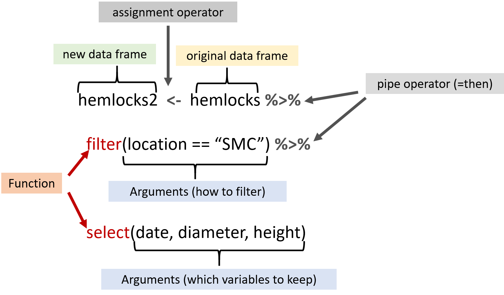

```{r setup, include=FALSE, exercise = TRUE}
# packages
library(learnr)
library(gradethis)
library(dplyr)
library(here)
library(r4bio)

#sets gradethis as exercise checker
gradethis::gradethis_setup()

tutorial_options(exercise.reveal_solution = FALSE)

# hide non-exercise code chunks
knitr::opts_chunk$set(echo = FALSE)
```

# Intro to R for Biology:  Working with Data


## Introduction

In this lesson, we will learn some basic ways to manipulate a data frame (often called data wrangling). These skills are key to be able to find and correct mistakes in data entry, understand a dataset, make graphs, summarize or model data, and more.

### Learning goals

* Use the `dplyr` package to filter, sort, and manipulate data
* How to find and remove missing data
* Learn about the pipe operator ` %>% `

```{r dplyr, out.width = "20%"}
knitr::include_graphics("images/dplyr_hex.png")
```


## Hemlock Data

Smith College Bio 131 students collected data on Eastern hemlock trees (*Tsuga canadensis*) in four different locations in Western Massachusetts. This is the same data that we learned how to import in the "Getting Data into R" tutorial. To make things simpler, this dataset is also included with this package and can be loaded just by loading the `r4bio` package.

We will be using a package called `dplyr` to manipulate and investigate the `hemlocks` dataset.  Let's load both of the necessary packages below:

```{r packages, exercise=TRUE, message=FALSE}
library(dplyr) #for manipulating data
library(r4bio) #for loading the hemlocks dataset

```


Not that there are # signs in the code above.  Any text you put after a # sign will be ignored by R.  This allows us to comment on our code so we can remember what we did and why later.  It is good practice to comment a lot for your future self and for others to be able to understand your code.

In the last "Getting Data into R" tutorial, we used several functions from base R to look at the structure of data.  Let's try the `glimpse()` function from the `dplry` package to look at the structure of the `hemlocks` dataset. 


```{r glimpse, exercise=TRUE, message=FALSE}

glimpse(hemlocks)

```

Notice that this data frame has several variables that are factors, a date variable, and a few numeric variables (shown as <dbl> which stands for double-precision floating point number which uses more memory to represent a value - basically just think of it as the same thing as numeric) 


```{r tree_num}

question_text("How many trees were measured in this data frame? (note that each row represents the data from an individual tree)",
              answer("298", correct=TRUE),
              answer("7", message="Nope, not the columns. How many rows does the datset have?"),
              incorrect = "Run `glimpse(hemlocks)` from the code chunk above to see the structure of the hemlocks dataset and type in the number given for rows.",
              allow_retry = TRUE,
              trim=TRUE
              )

```


## Summary()

In addition to using the `glimpse()` function, we can use the `summary()` function from base R which will give the minimum, 1st quartile, median, mean, 3rd quartile, maximum, and number of missing values (NA's) for each numeric variable (numeric columns), and the number of each category for each categorical variable (factor columns).  Run the code below and then look at the output.

```{r summary_h, exercise=TRUE, message=FALSE}

summary(hemlocks)

```


```{r hemlocks_quiz}

quiz(
  question("Which variables have missing values (denoted by having NA's)?",
           answer("location"),
           answer("diameter"),
           answer("height", correct=TRUE, message="You got it!"),
           answer("tag"),
           incorrect = "Look at the result of the `summary(hemlocks)` output above and find the variable that lists having NA's",
           allow_retry = TRUE,
           random_answer_order = TRUE)
  )

```

The reason there are so many missing values for height, is that the Smith College Bio 131 students have been measuring the diameter of the hemlock trees in all the years of data collection, but they only measured the height in some years.

## Filtering

One very common thing you will need to do to a dataset is filter for various values.  The `filter()` function in `dplyr` is a great tool to help us do that.

```{r filtering, out.width = "100%"}
knitr::include_graphics("images/dplyr_filter.jpg")
```

Artwork by [Allison Horst](https://github.com/allisonhorst/stats-illustrations)

##

Let's say that we are interested in only looking at data from Smith College (location is "SMC") where students actually measured the height of the trees.  

Let's start with location.  If we remove all the values for the other locations, that will remove lots of rows from the dataset.  To remove rows, we use the `filter()` function from the `dplyr` package.

Open the [help file for the `dplyr` package](https://dplyr.tidyverse.org/reference/filter.html) in a browser tab


Note that the first argument that the `filter()` function expects to see is the data in the form of a data frame.  The hemlocks dataset was already imported as a tibble, which is a special form of a data frame, so we just have to put the tibble object name in that location.

The next argument (...) is the part where we tell it which things we want to keep using comparison (equals, greater than, less than, etc) and logical (and, or, not) operators.  The last argument (.preserve) we will not be using here.

It is important to note that when you want the equal symbol in the filter() function, you have to use two equals signs together (==).  See the [Comparisons section in R for Data Science](https://r4ds.had.co.nz/transform.html#comparisons) for a detailed discussion of using comparison operators in the `filter()` function.

Another important thing is that when you are trying to filter for a character string (words rather than numbers), you need to put the character string in quotes.

Let's use `filter()` to choose just the Smith College location, give the result a new name (hemlocks2), and then look at the results using `glimpse()`

```{r filter1, exercise=TRUE, message=FALSE}

hemlocks2 <- filter(hemlocks, location == "SMC")

glimpse(hemlocks2)

```

```{r tree_num2}

question_text("Look at the number of rows shown as a result of `glimpse(hemlocks2)`.  How many observations does the new file have?",
              answer("65", correct=TRUE),
              answer("298", message="If you filtered the hemlocks dataset correctly, you should have fewer rows in the hemlocks.r dataset"),
              allow_retry = TRUE,
              trim=TRUE
              )

```

## Missing Data

Remember that we wanted data from Smith College, but we also want to remove any missing data (NA's) from the height variable.  Use the `summary()` function on the `hemlocks2` dataset to see if height still contains NA's.  Type the code below and submit your answer.

```{r hemlocks2, include=FALSE}

hemlocks2 <- filter(hemlocks, location == "SMC")

```

```{r summary2, exercise=TRUE, exercise.setup = "hemlocks2"}


```

```{r summary2-solution}

summary(hemlocks2)

```

```{r summary2-check}

grade_this_code()

```

Note that the `summary()` function now tells us that there are 65 rows with the location as "SMC" while the other locations all have zero.  This is good, this means we did the filtering for the "SMC" location correctly.  We can also see that there are still 34 NA's present in the height variable.

## Removing NA's

A useful function that we can use within the filter function is `is.na()`.  This function will select all the rows with NA's.  In this case we want to REMOVE all the rows with NA's, so we place an exclamation point in front of the function to denote NOT (! means "not equal to" in R)

To REMOVE the NA's for height and give the result a new name (hemlocks3), use the following code 

```{r remove_NA, exercise=TRUE, exercise.setup = "hemlocks2"}

hemlocks3 <- filter(hemlocks2, !is.na(height))

glimpse(hemlocks3)

```

```{r tree_num3}

question_text("Look at the number of rows shown as a result of `glimpse(hemlocks3)`.  How many observations does the new file have?",
              answer("31", correct=TRUE),
              answer("65", message="If you filtered the hemlocks dataset correctly, you should have fewer rows in the hemlocks3 dataset"),
              allow_retry = TRUE,
              trim=TRUE
              )

```


Use the `summary()` function on the `hemlocks3` dataset to see if height still contains NA's.  Type the code below and submit your answer.

```{r hemlocks3, include=FALSE}

hemlocks3 <- filter(hemlocks, location == "SMC", !is.na(height))

```

```{r summary3, exercise=TRUE, exercise.setup = "hemlocks3"}


```

```{r summary3-solution}

summary(hemlocks3)

```

```{r summary3-check}

grade_this_code()

```


If you did the filtering correctly, you should have only SMC values present for location and no remaining NA's in the height variable for the hemlocks3 dataset

## Sorting Data

We can use another function called `arrange()` in the `dplyr` package to sort the dataset if needed. 


```{r sort, exercise=TRUE, exercise.setup = "hemlocks3"}

arrange(hemlocks3, height)

```


Note that by default, `arrange()` sorts height in ascending order.

We can also sort in descending order by adding the `desc()` function around the variable name.


```{r sort2, exercise=TRUE, exercise.setup = "hemlocks3"}

arrange(hemlocks3, desc(height))

```

Sorting can sometimes be required for certain analyses but can also be useful for doing quality control on your data to make sure you don't have any more missing values or weirdly high or low values. 

## Selecting Data

In some cases, it might also be necessary to remove columns from your data.  We can use the `select()` function in `dplyr` to select just the columns we want.  It works similarly to `filter()`, but in this case we are working on columns rather than rows.

Let's select just three of the variables from the hemlocks3 dataset 

```{r select, exercise=TRUE, exercise.setup = "hemlocks3"}

select(hemlocks3, size.group, diameter, height)

```

You can see that we now have only 3 columns (just the 3 we selected in the code above)

## Calculations with Columns


We can also use `dplyr` to do calculations on a column using the `mutate()` function.

Let's say we want the radius of the trees rather than the diameter.  We can use `mutate()` to just divide the diameter column in half. 

```{r mutate, exercise=TRUE, exercise.setup = "hemlocks3"}

mutate(hemlocks3, radius = diameter/2)

```


You should now see a new column added to the dataset called radius with values that are half the diameter values

`dplyr` has lots of other useful functions. We will explore a few more in the "Descriptive Statistics" tutorial. 


## Changing Data Types

`mutate()` can also make changes to your existing columns if you give the new column the same name as the old column (the new column **replaces** the old column).  

Remember when we imported a csv file in the "Getting Data into R" tutorial we could use the `col_types()` function from `readr` to determine the data type of different columns. But what if we want to change the data type of a column after you have already imported something? You can do that with `mutate()`.

The general form we use is `mutate(mydata, var_name = as.datatype(var_name))`
Where mydata is the name of the data frame object, var_name is the name of the variable, and as.datatype is one of the functions that changes the data type (as.numeric, as.factor, as.character, as.Date, etc)

Let's pretend we want to change the location variable from the factor data type to character. We can do that with this code:

```{r data_types, exercise=TRUE}

mutate(hemlocks, location = as.character(location))

```

Notice that the location column now has character as the data type.

## Rename

Sometimes we need to rename a column in our data frame.  This often comes up when trying to merge two datasets when they have slightly different names (Date vs date can even cause problems).  or maybe we just get tired of typing long variable names.  To changet the name of a column, we can just use the `rename()` function in `dplyr` with the general form:

`rename(mydata, new_name = old_name)`

Run the code below for an example of how we could change the variable size.group to just size

```{r rename, exercise=TRUE}

rename(hemlocks, size = size.group)

```


## Pipes

Now that we are seeing more and more useful functions to help us manipulate our data, it may be clear that we might want to string together a bunch of different functions on the same set of data.

A really handy thing we can use to chain together a bunch of different lines of code is the pipe operator `%>%`.  The pipe operator is actually from a package called `magrittr`, but this gets installed automatically when you install `dplyr` so you don't have to load it yourself.

Think of the pipe operator as being the same as "and then".  Basically, you take the output of one set of code and then "pipe" the result into the next line of code.  It allows you to chain a bunch of code together.

Let's say you want to take the original hemlocks dataset and filter for trees from the Smith College ("SMC") and then select just the date, diameter, and height variables.  You could use the following code to do this using the pipe operator.

```{r pipes, out.width = "70%"}

```

What's great about the pipe operator is that you can reduce the amount of typing. Notice that we only typed the data object name first and then did not have to type it again in each function.  

Basically, the code we wrote says "Make a new object called hemlocks2 by first taking the object called hemlocks and then filter that for the SMC location, and then select the date, diameter, and height columns"


## Practice Coding

Try using what we have learned in this tutorial to write your own code.  

Take the original dataset `hemlocks` and call the new object `hemlocks4`.  
Use the pipe operator to link together two functions from `dplyr` so that the `hemlocks4` data frame gives data for just the "Sapling" trees and arrange by diameter in descending order.  Use the skeleton of the code given below and just fill in the blanks.


```{r example, exercise=TRUE}

___ <- ___ %>% 
  ___(size.group == "___") %>% 
  ___(___(___))
  
hemlocks4

```


```{r example-hint-1}

hemlocks4 <- hemlocks %>% 
  ___(size.group == "___") %>% 
  ___(___(___))

hemlocks4

```


```{r example-hint-2}

hemlocks4 <- hemlocks %>% 
  filter(size.group == "___") %>% 
  ___(___(___))

hemlocks4

```

```{r example-hint-3}

hemlocks4 <- hemlocks %>% 
  filter(size.group == "Sapling") %>% 
  ___(___(___))

hemlocks4

```

```{r example-hint-4}

hemlocks4 <- hemlocks %>% 
  filter(size.group == "Sapling") %>% 
  arrange(___(___))

hemlocks4

```


```{r example-hint-5}

hemlocks4 <- hemlocks %>% 
  filter(size.group == "Sapling") %>% 
  arrange(desc(___))

hemlocks4

```

```{r example-solution}

hemlocks4 <- hemlocks %>% 
  filter(size.group == "Sapling") %>% 
  arrange(desc(diameter))

hemlocks4

```

```{r example-check}

grade_this_code()

```


```{r ans_check}

question_text("Looking at the result which location is the sapling with the largest diameter measured from?",
              answer("SMC", correct=TRUE),
              answer("Smith", correct=TRUE),
              answer("Smith College", correct=TRUE),
              incorrect="If you did the filtering and arranging correctly, the row at the top of the new dataset should be the sapling with the largest diameter.  Which location is this tree from?",
              allow_retry = TRUE,
              trim=TRUE
              )

```

Notice that this arranging of saplings has allowed us to find some mistakes in the data.  Saplings are supposed to be <10 cm in diameter, but we can see that there are 4 trees categorized as saplings that have diameters greater than 10 centimeters. 

## Conclusion

Great work!  It takes a LOT of practice to be able to "wrangle" data well.  Don't feel shy about using the resources for this lesson and doing Google searches to help you figure out how to do things.  Until you do things a LOT, you will need to look up the code using examples, the help files, a cheat sheet, etc every single time. Keep practicing and it will get easier as you go.


```{r wrangling, out.width = "70%"}
knitr::include_graphics("images/data_cowboy.png")
```
 
Artwork by [Allison Horst](https://github.com/allisonhorst/stats-illustrations) 
 
## Resources

* [Wrangling penguins: some basic data wrangling in R with dplyr](https://allisonhorst.shinyapps.io/dplyr-learnr/#section-welcome): a longer learnr tutorial with more functions from `dplyr`, lots of examples, and more practice
* [Data Transformation with dplyr Cheat Sheet](https://github.com/rstudio/cheatsheets/blob/master/data-transformation.pdf): overview of how to use `dplyr`
* [Chapter 3 - Data Wrangling](https://moderndive.com/3-wrangling.html): ModernDive chapter on “wrangling” data into the form you need
* [Chapter 5 - Data transformations](https://r4ds.had.co.nz/transform.html#introduction-2): chapter in R for Data Science on how to manipulate data frames with `dplyr`
* [dplyr](https://dplyr.tidyverse.org/): a package that provides “a consistent set of verbs that help you solve the most common data * manipulation challenges”
* [How to Filter in R: A Detailed Introduction to the dplyr Filter Function](https://www.r-bloggers.com/2019/04/how-to-filter-in-r-a-detailed-introduction-to-the-dplyr-filter-function/)
* [Comparisons](https://r4ds.had.co.nz/transform.html#comparisons): what symbols give you the comparison operators (equals, not equals, greater than, less than, etc) when using functions such as `filter()`
* [Logical operators](https://r4ds.had.co.nz/transform.html#logical-operators): list of logical operators (what symbols give you and vs or, etc) when using functions such as `filter()`
* Introduction to the pipe operator (why it is useful and how to use it):
    + [The pipe operator](https://moderndive.com/3-wrangling.html#piping)
    + [Pipes](https://r4ds.had.co.nz/pipes.html)


