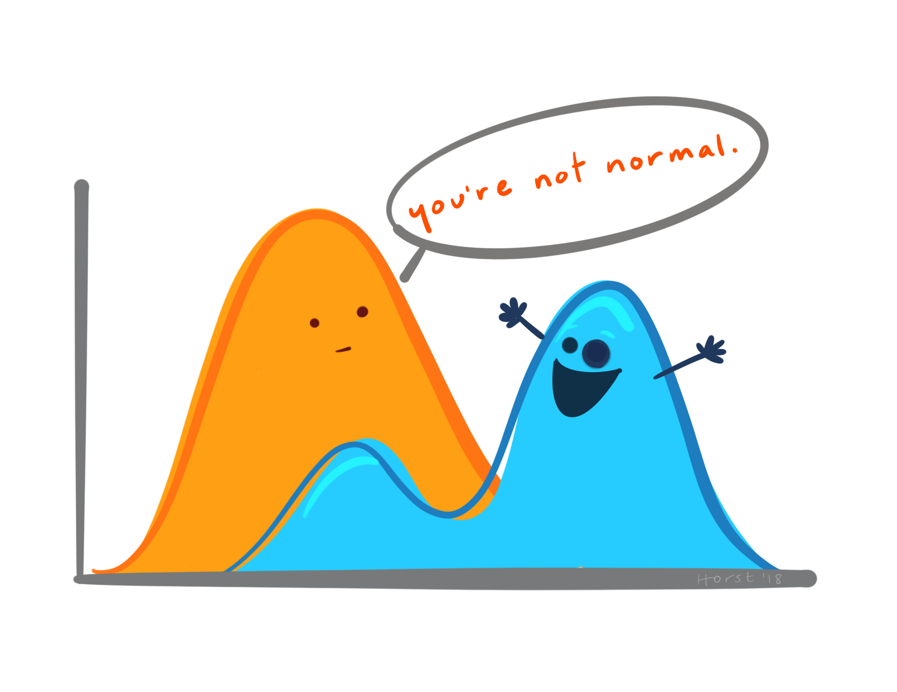

```{r setup, include=FALSE}
# packages
library(learnr)
library(gradethis)
library(dplyr)
library(ggplot2)
library(r4bio)

#sets gradethis as exercise checker
gradethis::gradethis_setup(
  code_correct = "Excellent Work!"
)

tutorial_options(exercise.reveal_solution = FALSE)

# hide non-exercise code chunks
knitr::opts_chunk$set(echo = FALSE)
```

# Intro to R for Biology:  Descriptive Statistics


## Introduction

In this lesson, we will learn some basic ways to summarize data with descriptive statistics using the `summarize()` and `group_by()` functions from the `{dplyr}` package.

We will also briefly cover some basic statistical concepts, but if you have never learned about descriptive statistics or need a refresher, please see the resources for this lesson for more detailed information.

This tutorial assumes you understand how to use the pipe operator (`|>` or `%>%`) and some other basic R skills. See the other **Intro to R for Biology** tutorials for review.

### Learning goals

* Learn some basic concepts about descriptive statistics
* Use the `group_by()` and `summarize()` functions from `{dplyr}` to calculate descriptive statistics

## Hemlocks Data

Like many of the tutorials in **Intro to R for Biology**, we will use the hemlocks dataset from the `{r4bio}` package. 

As a reminder, the hemlock data were collected by Smith College Bio 131 students. They measured the diameter and height for eastern hemlock trees at 4 locations in Western Massachusetts. After loading the `r4bio` package, you can get more information about the dataset by searching for `hemlocks` in the help tab in RStudio or typing `?hemlocks` in the RStudio Console or an R code chunk.

```{r hemlockshelp, exercise=TRUE}

library(r4bio) #load the r4bio package
?hemlocks      #open the help file for the data

```

## Measure of Central Tendency

In this lesson, we are focusing on descriptive statistics.  Let's start with measures of central tendency.  Basically, we want to know what a "typical" individual is within a sample.  The two measures of central tendency we will focus on are **mean** and **median**.

Recall the `summary()` function from base R that we used in the "Getting Data into R" tutorial.  This function can give us some basic information about each column of data.

Use the summary() function on the hemlocks data. Type the code below.

```{r summary, exercise=TRUE}


```

```{r summary-hint-1}

Remember, you just need to put the name of the object you want a summary for within the parentheses for the function.

```


```{r summary-solution}

summary(hemlocks)

```

```{r summary-check}

grade_this_code()

```


You can see in the `summary()` output that the median and the mean are given for each column with a numeric value or date. 

When summarizing a sample or population with descriptive statistics, we usually choose which measure of central tendency is more appropriate to use based on the "shape" or distribution of the data. Choose the mean when the data are normally distributed (or fairly close) and choose the median when the data are not normal.

## Normal Distribution

A normal distribution is when data show a "bell-shaped" curve where most individuals are centered symmetrically around the mean. For a true normal distribution, the mean and median are identical.


```{r normal, out.width = "70%"}

```

Artwork by [Allison Horst](https://github.com/allisonhorst/stats-illustrations) 


Below is the summary for just the diameter variable for the hemlocks data

```{r summary2, echo=FALSE}
summary(hemlocks$diameter)
```


```{r quiz1}

quiz(
  question("Looking at the mean and the median for diameter for all the hemlock trees shown above, would you say that the values are identical or very close?",
           answer("Yes - the mean and median values are identical or very close"),
           answer("No - the mean and median are different", correct=TRUE, message="You got it!"),
           incorrect = "Look at the result of the `summary(hemlocks)` output for diamater above and compare the mean and median values",
           allow_retry = TRUE,
           random_answer_order = TRUE)
  )

```

If the mean and the median are the same, that is one piece of evidence that the data may be normally distributed.  But how do we know what counts as different or the same when comparing the mean and the median? That is not always an easy question.  With a small sample size (especially less than ~20), it is not always possible to tell if data are normally distributed or not.

## Histograms

Another piece of evidence we can use to decide if the data are normal or not is to use some form of visualization.  A common way to visualize distributions is a histogram.  

See this link to learn more about [Histograms](https://moderndive.com/2-viz.html#histograms)
(NOTE: use CMD+click on a Mac or CTRL+click on a Windows computer to open the link in a different tab so you can also keep this tutorial open at the same time)

Run the code below to see a histogram of the diameter of the hemlocks

```{r histogram, exercise=TRUE, message=FALSE}

ggplot(data = hemlocks, aes(x = diameter))+ 
  geom_histogram(binwidth = 0.8, color = "white", fill= "#00BFC4") +
  xlab("Diameter (cm)") +
  ylab("Count") +
  coord_cartesian(expand=FALSE) +
  theme_classic(base_size=20) 


```


```{r quiz2}

quiz(
  question("Looking at the histogram of diameter for all the hemlock trees, would you say this shows a normal distribution (or it is fairly close to normal)?",
           answer("Yes - the distribution looks fairly close to normal"),
           answer("No - the distribution does not look normal", correct=TRUE, message="You got it!"),
           incorrect = "Does the shape of the histogram look symmetrical?",
           allow_retry = TRUE,
           random_answer_order = TRUE),
  question("What is the best measure of central tendency to describe the diameter of all the hemlock trees?",
           answer("Mean"),
           answer("Median", correct=TRUE),
           incorrect = "Remember, if a histogram shows a bell-shaped curve (or something fairly close), we can say it looks close to normal and we would use the mean as the measure of central tendency.  If the shape of the histogram is not bell-shaped, then it does not look normal and we would use the median as the measure of central tendency.",
           allow_retry = TRUE,
           random_answer_order = TRUE)
  )

```


## Dispersion

To summarize a sample or population, we need more than just the measure of central tendency.  We also need a measure of dispersion.  Dispersion is how spread out the data are.

There are several possible measures of dispersion you could use to describe the spread of the data.  When the data are normally distributed, we usually use the standard deviation.  When the data are not normal, a common measure of dispersion is the interquartile range (which gives the middle 50% of the data).  Look at the resources for this tutorial if you want to learn more about measures of dispersion.

Let's use the `summarize()` function from the `{dplyr}` package to calculate some descriptive statistics for the diameter of all the hemlock trees.  (note that you can spell the function `summarize()` or `summarise()` but we will use `summarize()` in this tutorial)

The general form for the `summarize()` function using the base R pipe operator is

```
mydata |>
    summarize(label_name = function(column_name))
```

* **mydata** is the name of the data frame
* **label_name** is how you want to label the output
* **function** is the function you want to use such as mean, sd, median, IQR
* **column_name** is the name of the column you want to summarize


Don't forget, we need to load the `{dplyr}` package before we can use any functions from it. Also note that there are comments after `#` to tell you what each line of code is doing.

```{r sum1, exercise=TRUE}
library(dplyr)

hemlocks |>      #take the hemlocks data frame and then
  summarize(     #summarize the following
            Mean = mean(diameter),     #calculate the mean diameter and call it Mean
            SD = sd(diameter),         #calculate the standard deviation of the diameter and call it SD
            Median = median(diameter), #calculate the median diameter and call it Median
            IQR = IQR(diameter),       #calculate the interquartile range of the diameter and call it IQR
            N=n())                     #count the number of trees in the dataset
```


```{r quiz3}

quiz(
  question("If we want to describe the diameter variable from this dataset what values would we give for the measure of central tendency and dispersion respectively?",
           answer("Mean and Standard Deviation"),
           answer("Median and IQR", correct=TRUE),
           answer("Mean and IQR"),
           answer("Median and Standard Deviation"),
           incorrect = "Did the histogram look symmetrical (~normal)?",
           allow_retry = TRUE,
           random_answer_order = TRUE)
)

question_text("Another important value to report is the sample size.  How many trees had their diameters measured in total?",
              answer("298", correct=TRUE),
              incorrect = "We counted the number of trees in the summarize() function and the result is denoted by the column N",
              allow_retry = TRUE,
              trim=TRUE
              )

```


## Missing Values

Let's try doing the same thing with a different variable - height

```{r sum2, exercise=TRUE}

hemlocks |> 
  summarize(Mean = mean(height),
            SD = sd(height),
            Median = median(height), 
            IQR = IQR(height), 
            N=n()) 
```

Why is R giving you an error?  The error message indicates that it has something to do with missing values. Let's look for missing values (NA's) with the `summary()` function


```{r summary3, exercise=TRUE}

summary(hemlocks)

```

Aha - there are 173 NA's for the height variable!


We have a few options to deal with this.  We can filter out the missing values for height (see the "Working with Data" lesson for practice doing that). Or we can tell `summarize()` to ignore the missing values.  We will do the latter below

```{r missing, exercise=TRUE}

hemlocks |> 
  summarize(Mean = mean(height, na.rm=TRUE),
            SD = sd(height, na.rm=TRUE),
            Median = median(height, na.rm=TRUE), 
            IQR = IQR(height, na.rm=TRUE), 
            N = sum(!is.na(height)))

```

It worked!

We have added the `na.rm=TRUE` argument to each function within `summarize()` to tell summarize to ignore the missing values for that calculation

We also had to change from `n()` to `sum()` to count the rows in the height variable that did not have NA's

Once we told `summarize()` to remove or ignore the missing values, it was able do the calculations we wanted. But do we report the mean and SD or the median and IQR? We can compare the mean and the median for one clue. They look pretty different.  

##

Let's make a histogram for the height variable

```{r hist_height, exercise=TRUE}

#remove missing values
hemlocks.h <- hemlocks |> 
  filter(!is.na(height))

#graph histogram
ggplot(data = hemlocks.h, aes(x = height))+ 
  geom_histogram(binwidth = 30, color = "white", fill= "#00BFC4") +
  xlab("Height (cm)") +
  ylab("Count") +
  coord_cartesian(expand=FALSE) +
  theme_classic(base_size=20) 
```

```{r quiz4}

quiz(
  question("Looking at the histogram of height for all the hemlock trees, would you say this shows a normal distribution (or it is fairly close to normal)?",
           answer("Yes - the distribution looks fairly close to normal"),
           answer("No - the distribution does not look normal", correct=TRUE, message="You got it!"),
           incorrect = "Does the shape of the histogram look symmetrical?",
           allow_retry = TRUE,
           random_answer_order = TRUE),
  question("Given the information you have from looking at the descriptive statistics and the histogram, which values should we report to summarize the height variable?",
           answer("Mean and Standard Deviation"),
           answer("Median and IQR", correct=TRUE),
           answer("Mean and IQR"),
           answer("Median and Standard Deviation"),
           incorrect = "Remember, if the shape of the histogram is not bell-shaped (~normal), then a median and IQR are better descriptive statistics to summarize the data.",
           allow_retry = TRUE,
           random_answer_order = TRUE)
  )

```


From the results we have seen so far, it looks like we sampled more small trees than larger trees.  Let's look at the descriptive statistics for the three size classes of trees (mature, sapling, seedling).  

## Grouping

We can use the `group_by()` function along with the `summarize()` function to calculate descriptive statistics for subgroups within our data.  We put the name of the column we want to use for our groupings in the `group_by()` function first and then pipe that result into `summarize()`

In this case, we are going to use the `size.group` variable which contains the three size classes of trees (Mature, Sapling, Seedling) to group our data

```{r sum3, exercise=TRUE, message=FALSE}

hemlocks |> 
  group_by(size.group) |> 
  summarize(Mean = mean(diameter),
            SD = sd(diameter),
            Median = median(diameter), 
            IQR = IQR(diameter), 
            N=n())

```


Do you see what adding `group_by()` does?  It allows us to compute the descriptive statistics for each group of interest (in this case size class of hemlock trees).

Let's make a histogram that also splits by size class (note that the code to make a histogram is shown below, but we will learn how to make graphs using `{ggplot2}` in other tutorials)

```{r hist_size, exercise=TRUE}

library(ggplot2)

ggplot(data = hemlocks, aes(x = diameter, fill = size.group))+ 
  geom_histogram(binwidth = 0.8, color = "white", fill= "#00BFC4") +
  facet_grid(size.group ~ .) +
  xlab("Diameter (cm)") +
  ylab("Count") +
  coord_cartesian(expand=FALSE) +
  theme_classic(base_size=20) 

```


Look at the results of the descriptive statistics and the histograms that break things up into the seedling, sapling, and mature tree size classes.  It looks like the mature trees and seedlings are a little closer to a normal distribution (more symmetrical at least), while saplings are still a bit skewed with more smaller trees than you would expect for a normal distribution.  

This could indicate that the trees were not truly sampled randomly, or that the forest itself has more small trees than you would expect compared to a normal distribution (especially in the sapling size class). 
Because these trees were measured by students during a lab class, we were limited by time and did not in fact sample randomly. It is also possible that the distribution of sizes is not normal, but more sampling (that is more representative and ideally random) would be needed to have enough evidence to determine this.


## Conclusion

You now have the skills to calculate some basic descriptive statistics in R.

This lesson and overall course do not go into depth on how to determine if data are normally distributed or how to transform non-normal data.  An example of a more in-depth resource is Chapter 10 - The normal distribution from Whitlock and Schluter 2020 ([online resources associated with Chapter 10](https://whitlockschluter3e.zoology.ubc.ca/chapter10.html)).

The next lesson will help you learn how to make histograms and other graphs using the `ggplot()` function in the `{ggplot2}` package.


## Resources

* [Basic statistical terms](https://moderndive.com/A-appendixA.html): appendix from ModernDive that discusses mean, median, quartiles, standard deviation, normal distribution, etc
* [Histograms](https://moderndive.com/2-viz.html#histograms): description of what a histogram is from ModernDive
* [Data Analysis and Graphing Lectures Playlist](https://www.youtube.com/playlist?list=PLkLhQ6GLnCjIpiMv94CBrflFQ0BHoGZUV): videos include a 2 part series on descritive statistics and the normal distribution
* Chapter 3: Describing Data from Whitlock and Schluter 2020 textbook: more information about descriptive statistics from a biological perspective ([online resources associated with the chapter](https://whitlockschluter3e.zoology.ubc.ca/chapter03.html))
* Chapter 10 - The normal distribution from Whitlock and Schluter 2020 textbook ([online resources associated with Chapter 10](https://whitlockschluter3e.zoology.ubc.ca/chapter10.html)): more indepth coverage of the normal distribution.
* [Grouped data](https://dplyr.tidyverse.org/articles/grouping.html): vignette on using `group_by()`
* [Summarise each group to fewer rows](https://dplyr.tidyverse.org/reference/summarise.html): vignette on using `summarize()` (can also be spelled `summarise()`)

