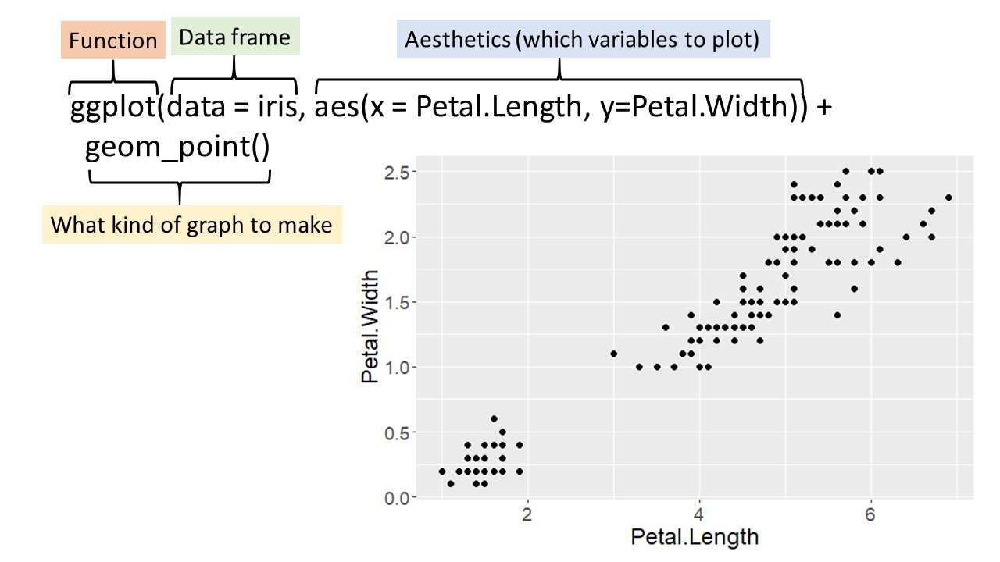

```{r setup, include=FALSE}
# packages
library(learnr)
library(gradethis)
library(dplyr)
library(ggplot2)
library(r4bio)

#sets gradethis as exercise checker
gradethis::gradethis_setup(
  code_correct = "Excellent Work!"
)

tutorial_options(exercise.reveal_solution = FALSE)

# hide non-exercise code chunks
knitr::opts_chunk$set(echo = FALSE)
```

# Intro to R for Biology:  Graphing with ggplot


## Introduction

In this lesson, we will learn how to make several types of graphs using the `ggplot()` function in the `{ggplot2}` package.  

To complete this tutorial successfully, you will need to understand variable types (continuous, categorical, dependent, independent, etc), what a histogram, boxplot, and scatterplot are, and be able to build on the tutorials that came before this one in the **Intro to R for Biology** course.  Use the resources given for this lesson to help you with basic terminology and understanding the different graph types if you haven't learned it before or need a refresher.

### Learning goals

* Use the `{ggplot2}` package to make
    + scatterplots
    + histograms
    + box plots
    + dot plots
* Learn how to do a log transformation of axes and data
* Learn some best practices in basic data visualization

## Hemlocks Data

Like many of the tutorials in **Intro to R for Biology**, we will use the hemlocks dataset from the `{r4bio}` package. 

As a reminder, the hemlock data were collected by Smith College Bio 131 students. They measured the diameter and height for eastern hemlock trees at 4 locations in Western Massachusetts. After loading the `r4bio` package, you can get more information about the dataset by searching for `hemlocks` in the help tab in RStudio or typing `?hemlocks` in the RStudio Console or an R code chunk.

```{r hemlockshelp, exercise=TRUE}

library(r4bio) #load the r4bio package
?hemlocks      #open the help file for the data

```

## Grammar of Graphics

The gg in ggplot stands for the "grammar of graphics" which is a type of visualization theory developed by Leland Wilkinson. This theory has a defined set of rules that builds a graph by using layers.  

In the `ggplot()` function from the `{ggplot2}` package there are three essential components to making any graph:

1. the data
3. aesthetics attributes (aes) such as which variables go with which axes, color, shape, fill, size etc 
2. a geometric object (=geom) such as a point, line, or bar    
<br>


```{r normal, out.width = "100%"}

```


## Hemlock Height vs Diameter

Let's start with making a graph of the diameter and height of the hemlock trees.  We know the name of our data (hemlocks), and we know the variables of interest (diameter and height).  But how do we know which variable should go on the x- vs y-axis?  How do we know what type of geometric object (geom) to use?


```{r quiz1}

quiz(
  question("Height and diameter are the same kind of variable - what kind of variable are they?",
           answer("categorical"),
           answer("logical"),
           answer("numerical", correct=TRUE, message="You are amazing!"),
           incorrect = "review some of the resources on variable types and try again",
           allow_retry = TRUE,
           random_answer_order = TRUE)
  )

```

##

Height and diameter are both numerical variables, but more specifically they are continuous variables that can take on any value (within a range - in this case they have to be greater than zero and can't get larger than it is possible for a hemlock to physically get)

```{r quiz2}

quiz(
  question("What kind of graph would we use when we have two continuous variables?",
           answer("bar graph"),
           answer("histogram"),
           answer("box plot"),
           answer("scatterplot", correct=TRUE, message="You know your stuff!"),
           incorrect = "Look at the resources for this lesson if you don't know what these graph types are and then try again",
           allow_retry = TRUE,
           random_answer_order = TRUE)
  )

```


## Scatterplots

To make a scatterplot using `ggplot()`, we use the point geometric object by calling on the `geom_point()` function.

So now we have our data and our geom, but what about aesthetics?  At the very least we need to know which variable should go on the x-axis and which on the y-axis.  

For a scatterplot, we often put the independent variable (also called the predictor) on the x-axis and the dependent variable (also called the response variable) on the y-axis.  

The dependent variable value depends on the independent variable (or you could say the response responds to the predictor).  Sometimes, you just want to see if two variables are correlated and it doesn't matter which one goes on which axis, and other times it matters a lot.

In this case it doesn't really matter too much, but since we chose trees partly based on their diameter let's put the diameter on the x-axis and the height on the y-axis.

As you saw in previous tutorials, there are a lot of missing values for the height variable.  Let's use `filter()` to remove the missing height values before we begin graphing (and use `summary()` to make sure there are no more NA's)

```{r hemlocks2, exercise=TRUE}

hemlocks2 <- hemlocks |>
                filter(!is.na(height)) 

summary(hemlocks2)

```

Great - no NA's remain.  Now let's make a graph with `ggplot()`

```{r scatter, exercise=TRUE, exercise.setup = "hemlocks2"}

ggplot(data = hemlocks2, aes(x = diameter, y = height)) +
      geom_point()

```


This graph is fine for a quick look, but it could look nicer.

## 

Let's make a nicer looking graph by adding a color for each group (in this case using the size.class variable), make nicer looking labels rather than what we have for column headings in our dataset, and make the overall graph look cleaner (remove the gray background and gridlines) with larger font size.

Note the comments marked by `#` below to tell you what each line of code we changed does


```{r scatter2, exercise=TRUE, exercise.setup = "hemlocks2"}

ggplot(
  data = hemlocks2,   #still using the hemlocks2 dataset
  aes(x = diameter, y = height, color = size.group)) + #adding color = size.group makes each size class a different color
      geom_point(size = 3) + #adding size = 3 made the points a little larger
      ylab("Height (cm)") + #adds a nicer label for the y-axis
      xlab("Diameter (cm)") + #adds a nicer label for the x-axis
      labs(color = "Size Class") + #relabels the size.group variable in the legend to look nicer
      theme_classic(base_size = 18) #theme_classic() takes away the gray background and makes the graph look nicer in general, base_size = 18 makes the base font size larger for the whole graph


```

This graph is looking better. But what if we want to compare the relationship between height and diameter at the 4 different locations?

## Scatterplot with Line

Below is code that is almost identical to the previous graph, but we have changed the `color` aesthetic to **location** and added a line of code with the function `geom_smooth()` which adds a line for each group defined by `color`

```{r scatter3, exercise=TRUE, message=FALSE, exercise.setup = "hemlocks2"}

ggplot(
  data = hemlocks2, 
  aes(x = diameter, y = height, color = location)) + #changed color to location
      geom_point(size = 3) +
      geom_smooth(method = "lm", se = FALSE) + #add line of best fit
      ylab("Height (cm)") +
      xlab("Diameter (cm)") +
      labs(color = "Location") +
      theme_classic(base_size = 18)


```


This is looking pretty good.  But we can do better.  The smaller trees are all rather squished together, and the larger trees are nicely spread out.  It looks like doing a log transformation might spread the data out better.  
 

## Log Transformation


Let's change the height and diameter each to a log scale by just wrapping the x and y-variables in the `log()` function.

```{r scatter4, exercise=TRUE, message=FALSE, exercise.setup = "hemlocks2"}

ggplot(
  data = hemlocks2, 
  aes(x = log(diameter), y = log(height), color = location)) + #x and y wrapped in log() function
      geom_point(size = 3) +
      geom_smooth(method = "lm", se = FALSE) +
      ylab("log(Height (cm))") +    #added log() to the y-axis label
      xlab("log(Diameter (cm))") +  #added log() to the x-axis label
      labs(color = "Location") +
      theme_classic(base_size = 18)

```

There - doesn't that look better?  It is easier to see everything when the values are spread more evenly.  

The above graph takes the values in x- and y- and does a log transformation of those values. 

Alternatively, we can just make the scale of the x- and y-axes log-scaled without transforming the actual values.  This is sometimes easier to interpret because the values themselves are still in the original units.

```{r scatter5, exercise=TRUE, message=FALSE, exercise.setup = "hemlocks2"}

ggplot(
  data = hemlocks2, 
  aes(x = diameter, y = height, color = location)) + 
      geom_point(size = 3) +
      geom_smooth(method = "lm", se = FALSE) + 
      ylab("Height (cm)") +
      xlab("Diameter (cm)") +
      labs(color = "Location") +
      theme_classic(base_size = 18) +
      scale_y_log10() +     #changes y-axis to log-scale
      scale_x_log10() +     #changes x-axis to log-scale
      annotation_logticks() # adds log-scale tick marks


```

This is a nice looking graph that is easy to read.

See [ggplot Log Scale Transformations](https://www.datanovia.com/en/blog/ggplot-log-scale-transformation/) for some additional useful tips for log-transformations in `ggplot()`

## Histogram

The next type of graph we are going to practice making is a histogram.  Histograms are not as often used to present data formally in a paper, poster, or presentation, but they are very useful to exploring the distribution structure of your data.  

Use the links in the resources at the end of this tutorial if you are not familiar with what a histogram is.

Let's make a histogram of diameter of all the hemlock trees. The code below will give us a histogram of the diameters of all the hemlock trees in the orginal dataset. Note that when we use `geom_histogram()` we only use one variable in the aesthetics (`aes()`) and then R counts up the number of cases in each bin for you. You decide how wide each bin is by setting the binwidth.


```{r hist1, exercise=TRUE}

ggplot(
  data = hemlocks, 
  aes(x = diameter)) + 
   geom_histogram(binwidth = 0.8, color = "white", fill= "#00BFC4") +
   xlab("Diameter (cm)") +
   ylab("Count") +
   theme_classic(base_size=20) 

```


Look at the histogram of the diameters of all the trees.  This distribution is right skewed, which means that there is a longer "tail" on the right and the peak is shifted over to the left.

Something to note about histograms is that you can change the "binwidth" to make the bins larger or smaller.  Each bin is a range of diameters and the bar in that bin is the number of trees that have diameters in that range.  We can increase or decrease the size of the bins - which will mean the range of diameters for each bin is increased or decreased.

Change the binwidth to 5 in the code below

```{r hist2, exercise=TRUE}

ggplot(
  data = hemlocks, 
  aes(x = diameter)) + 
   geom_histogram(binwidth = 0.8, color = "white", fill= "#00BFC4") +
   xlab("Diameter (cm)") +
   ylab("Count") +
   theme_classic(base_size=20) 

```


```{r hist2-solution}

ggplot(
  data = hemlocks, 
  aes(x = diameter)) + 
   geom_histogram(binwidth = 5, color = "white", fill= "#00BFC4") +
   xlab("Diameter (cm)") +
   ylab("Count") +
   theme_classic(base_size=20) 

```


```{r hist2-check}

grade_this_code()

```


```{r quiz3}

quiz(
  question("What happened to the histogram when we changed the binwidth from 0.8 to 5?",
           answer("the bars got skinnier"),
           answer("the bars stayed the same"),
           answer("the bars got fatter", correct=TRUE, message="They sure did get fatter!"),
           incorrect = "take a look at both graphs above and try again",
           allow_retry = TRUE,
           random_answer_order = TRUE)
  )

```


It is always good to play around with the binwidth a little until you find what works best for a particular variable.  You want enough bars to truly see the shape of the data distribution without having too many super skinny bars.

## Grouped Histograms

Like we did in the "Descriptive Statistics" tutorial, let's split the diameter data into size classes using the `facet()` function.

Note that there was one larger tree at MacLeish (MCL) that was 73 cm in diameter and this one tree was cut off this graph because we set the max for the x-axis to 45 here using `coord_cartesian(xlim = c(0,45))` so we could see the majority of the data better.

```{r hist3, exercise=TRUE}

ggplot(
  data = hemlocks, 
  aes(x = diameter))+ 
   geom_histogram(binwidth = 0.8, color = "white", fill= "#00BFC4") +
   facet_grid(size.group ~ .) +
   xlab("Diameter (cm)") +
   ylab("Count") +
   coord_cartesian(xlim = c(0,45)) +
   theme_classic(base_size=20) 

```

Look at the resulting set of histograms.  Note that the distribution is different for the three different size classes.

##

Below is the same code as the previous code. Modify the code so that it is split by the type of infestation (variable = infest) rather than size class. Leave everything else the same

```{r hist4, exercise=TRUE}

ggplot(
  data = hemlocks, 
  aes(x = diameter))+ 
   geom_histogram(binwidth = 0.8, color = "white", fill= "#00BFC4") +
   facet_grid(size.group ~ .) +
   xlab("Diameter (cm)") +
   ylab("Count") +
   coord_cartesian(xlim = c(0,45)) +
   theme_classic(base_size=20) 

```


```{r hist4-solution}

ggplot(
  data = hemlocks, 
  aes(x = diameter))+ 
   geom_histogram(binwidth = 0.8, color = "white", fill= "#00BFC4") +
   facet_grid(infest ~ .) +
   xlab("Diameter (cm)") +
   ylab("Count") +
   coord_cartesian(xlim = c(0,45)) +
   theme_classic(base_size=20) 

```

```{r hist4-check}

grade_this_code()

```

The hemlocks in Western Massachusetts have two invasive insects infesting them - the elongate hemlock scale (EHS) and hemlock woolly adelgid (HWA). Both means that the tree has both insects infesting it, EHS means just EHS was on the tree, and HWA means just HWA was on the tree.  All of the trees had at least one of the insects present (there are no trees in the "Neither" category).

The size distribution looks fairly similar between the trees that had both insects present and just EHS.  However, there are very few trees with just HWA present. The distribution is skewed with more smaller trees than you would expect for a normal distribution.  This could indicate that the trees were not truly sampled randomly, or that the forest itself has more small trees than you would expect compared to a normal distribution.  More information on how the trees were sampled or more testing would be needed to see if the distribution of hemlock diameters in these forests is truly not normal.

## Box Plot

Another type of graph we are going to practice making in this lesson is a box plot.  

Similar to the histograms we just made, let's make a box plot of hemlock diameter split by infestation. 

In this case, we will use `geom_boxplot()` with infestation as the x-variable and diameter as the y-variable.


```{r box1, exercise=TRUE}

ggplot(
  data = hemlocks, 
  aes(x= infest, y = diameter)) + 
  geom_boxplot() +
  ylab("Tree Diameter (cm)") +
  xlab("Infestation") +
  theme_classic(base_size=20)

```


If you are unfamiliar with box plots in general, look at the [diagram showing the boxplot anatomy](https://www.data-to-viz.com/caveat/boxplot.html) 

To understand what `geom_boxplot()` is showing specifically, read the [Summary Statistics](https://ggplot2.tidyverse.org/reference/geom_boxplot.html#summary-statistics) subsection of the `geom_boxplot()` reference webpage 

Note that what the "whiskers" in a box plot represent varies, so make sure you read about what the default is for all the parts of `geom_boxplot()` including the "whiskers"


```{r quiz4}

quiz(
  question("What do you think the horizontal bar within the box represents?",
           answer("mean"),
           answer("1st quartile"),
           answer("median", correct=TRUE, message="Yep - the middle orizontal bar in the box is the median (=2nd quartile, =50th percentile)"),
           incorrect = "look at the link above to the diagram showing the boxplot anatomy and try again",
           allow_retry = TRUE,
           random_answer_order = TRUE)
  )

```


##

Like a histogram, a box plot can help us determine whether a distribution is normal.  If the median is in the center of the box, the whiskers are symmetrical, and there are few if any major outliers then this may be a clue that the distribution is normal or close to normal.  Recall that the mean and the median are the same when the distribution is normal.  Thus, it can be useful to add the mean to a box plot so we can visually see whether the mean and median are similar or not.

Let's add the mean to our box plots using the `stat_summary()` function. The mean is shown using an x 

```{r box2, exercise=TRUE}

ggplot(
  data = hemlocks, 
  aes(x = infest, y = diameter)) + 
  geom_boxplot() + 
  stat_summary(fun=mean, geom="point", 
               shape=4, size=2, 
               colour="black", stroke=2) + #these three lines within stat_summary() add an X to represent the mean
  ylab("Tree Diameter (cm)") +
  xlab("Infestation") +
  theme_classic(base_size=20) 

```

Notice in the plots panel that the box plots look the same except an "x" has been added to each box which indicates the mean.


```{r quiz5}

quiz(
  question("Do the data look normally distributed as visualized in these box plots?",
           answer("Yes"),
           answer("No", correct=TRUE, message="Right! The boxes and whiskers don't look very symmetrical."),
           incorrect = "Are the boxes and whiskers fairly symmetrical? Are the means and medians close together?",
           allow_retry = TRUE,
           random_answer_order = TRUE)
  )

```


## Adding Points

One disadvantage of box plots is that they can hide your data.  You can't tell the sample size or more details about the distribution from just the box plots. However, we can add the data points to the box plots if desired.

Let's add the points from individual trees to our box plots. 

The code below is the similar to the previous one with the following changes
* Addition of points using `geom_point()`
    + An additional `aes()` is included within `geom_point` to make the fill of the points different colors based on infestation.  
    + We have also "jittered" the points horizontally using the `position` statement so they don't overlap each other too much.  Changing the `alpha` of the points makes them partially transparent so they show but don't stand out too much and obscure each other and the boxes.
* Removed the outlier points using `outlier.shape=NA` because the presence of the points make having outlier points redundant (they just overlap each other)
  
  
```{r box3, exercise=TRUE}

ggplot(
  data = hemlocks, 
  aes(x = infest, y = diameter)) + 
  geom_boxplot(outlier.shape= NA) +  #changed to remove the outliers since all the points are included
  geom_point(aes(x= infest, y = diameter, fill = infest), #adds point but colors them by infestation
             shape=21, size=2, alpha = 0.5, #sets the size, shape, and transparency of the points
             position=position_jitterdodge(jitter.width=1.5), #jitters the points horizontally so they avoid overlap
             show.legend=FALSE) + #a legend isn't really needed so I removed it
  stat_summary(fun=mean, geom="point", shape=4, size=2, colour="black", stroke=2) +
  ylab("Tree Diameter (cm)") +
  xlab("Infestation") +
  theme_classic(base_size=20) 

```

  
Whether you include the mean or points on your box plots depends on whether they are useful for the particular dataset.  If you have really large sample sizes, including the points can be overwhelming and distracting.  There are other types of plots (such as a violin plot) that may be better for very large sample sizes to show the distribution of the data.  We will cover more options for graphing in the "Graphing Grouped Continuous Data" tutorial.

## Dot Plots 

Sometimes your sample size is too small to use a histogram or box plot.  Ideally, you want a sample size of 30 or larger in each group for histograms and box plots.  What do we do when we have smaller sample sizes?

When you have small sample sizes (<30 in each group is a good rule of thumb - but note that there is no hard and fast rule), it is usually best to show all your data and add a measure of central tendency (the mean or median).


Let's take away the box plot and just leave the points and the measure of central tendency (in this case the median since the data are not normal).  

As in the previous graph, the code below uses the `position` statement in `geom_point()` to "jitter" the points horizontally

Also similar to the box plot, we have used the `stat_summary()` function here, but this time we are graphing the median since these data are not normally distributed

We also removed the legend by using `theme(legend.position="none")`.  The legend is not needed here because which group goes with which points is already labeled on the x-axis


```{r dot, exercise=TRUE}

ggplot(
  data = hemlocks, 
  aes(x = infest, y = diameter, fill = infest)) + 
  geom_point(shape=21, size=3, alpha = 0.5,   #adds jittered points
             position=position_jitterdodge(jitter.width=1)) +
  stat_summary(fun = median, fun.min = median, fun.max = median,  #adds median
               geom = "crossbar", width = 0.5, size = 0.75, colour = "black") +  #sets the look of the median
  ylab("Tree Diameter (cm)") +
  xlab("Infestation") +
  theme_classic(base_size=20) +
  theme(legend.position="none") #removes the legend because it isn't needed here

```


Notice that this graph is pretty similar to the last one except the boxes and mean are gone and all that is left are the points and the median.  If the data were normally distributed, you would use the mean for the bar rather than the median.  

What do we call this type of graph?  It can be called a "univariate scatterplot", "dot plot", or "strip chart".  We will use "**dot plot**" for this type of graph in this course.

Often when we summarize data, we use a measure of central tendency (usually the mean or the median) and a measure of dispersion (standard deviation, interquartile range, range, etc).  Why do we only show the median in this graph?  Since we are showing all of the points, how spread out the points are is already clearly apparent. You could add an interquartile range or add the boxes back in if you want to.

If you want to show how confident you are in your estimation of a mean, you can show 95% confidence intervals around the mean.  Keep in mind that a **confidence interval is a type of inferential statistic and is not simply descriptive**.


## Practice

Below is the code for a box plot with points. Play around with the code on your own and see what you can make.

What happens when you remove things?  How can you change the look using color, shape, size, etc?  Use the [Data Visualization with ggplot2 Cheat Sheet](https://github.com/rstudio/cheatsheets/raw/master/data-visualization-2.1.pdf) and other resources for this tutorial to learn how to make other changes.  


The best way to learn coding and data visualization is through trial and error and just exploring. You aren't going to hurt anything, and you can click the **Start over** button to get back the original code and try again.

**Have fun and experiment!**

```{r play, exercise=TRUE}

ggplot(
  data = hemlocks, 
  aes(x = infest, y = diameter)) + 
  geom_boxplot(outlier.shape= NA) +  
  geom_point(aes(x= infest, y = diameter, fill = infest), 
             shape=21, size=2, alpha = 0.5, 
             position=position_jitterdodge(jitter.width=1.5),  
             show.legend=FALSE) + 
  stat_summary(fun=mean, geom="point", shape=4, size=2, colour="black", stroke=2) +
  ylab("Tree Diameter (cm)") +
  xlab("Infestation") +
  theme_classic(base_size=20) 

```

If you want to save a copy of a graph you make, you can take a screen shot or right-click (Windows) or command-click (Mac) and then select the option to copy or save the image. These options are fine for low quality versions of the graph. Use the [ggsave()](https://ggplot2.tidyverse.org/reference/ggsave.html) function from the `{ggplot2}` package to save a higher quality version of your graphs.

## Conclusion


There are **MANY** more types of graphs you can make with ggplot.  Check out the [R Graph Gallery](https://www.r-graph-gallery.com/) for the R code to make a huge number of different types of graphs.

Check out the "Graphing Grouped Continuous Data" tutorial for more options and tips for best practice when graphing a continuous dependent variable versus a categorical independent variable.

```{r ggplot_paint, out.width = "80%"}
knitr::include_graphics("images/ggplot2_masterpiece.png")
```

Artwork by [Allison Horst](https://github.com/allisonhorst/stats-illustrations) 


## Resources

* [Data Visualization with ggplot2 Cheat Sheet](https://github.com/rstudio/cheatsheets/raw/master/data-visualization-2.1.pdf)
* [Chapter 2 - Data Visualization](https://moderndive.com/2-viz.html): chapter from ModernDive on basic data visualization
* [Chapter 3 - Data Visualisation](https://r4ds.had.co.nz/data-visualisation.html): chapter from R for Data Science on basic data visualisation
* [Examining Numerical Data](https://www.youtube.com/watch?v=Xm0PPtci3JE&list=PLkIselvEzpM6pZ76FD3NoCvvgkj_p-dE8&index=6): Video overview of some basic statistical information including types of graphs, mean, SD, median, and IQR from OpenIntro Statistics
* [Types of Variables](youtube.com/watch?list=PLkIselvEzpM6pZ76FD3NoCvvgkj_p-dE8&v=Mjif8PTgzUs): Video overview of some basic statistical from OpenIntro Statistics terminology including observations, variables, and data matrices
* [Types of Variables](https://bolt.mph.ufl.edu/6050-6052/preliminaries/types-of-variables/): Quick overview of different variable types from the Biostatistics Open Learning Textbook
* [The boxplot and its pitfalls](https://www.data-to-viz.com/caveat/boxplot.html): a good overview of boxplots
* [R Graph Gallery](https://www.r-graph-gallery.com/): how to make many different types of graphs in R

### Help pages for each type of graph in `ggplot()` we covered in this tutorial

* [geom_point](https://ggplot2.tidyverse.org/reference/geom_point.html)
* [geom_histogram](https://ggplot2.tidyverse.org/reference/geom_histogram.html)
* [geom_boxplot](https://ggplot2.tidyverse.org/reference/geom_boxplot.html)
